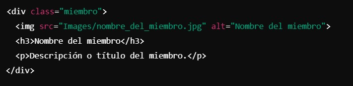

## Ajustes en Website Content
-Cómo agregar más miembros al sitio web
  1. Subir alguna foto o inamgen a la carpeta images dentro de WebsiteContent
  2.	Localizar el código de los miembros actuales:
        *	Abrir el archivo [index.html](https://github.com/LaboratorioSaludVisual/LabSaludVisual/blob/main/index.html) o [index_es.html](https://github.com/LaboratorioSaludVisual/LabSaludVisual/blob/main/index_es.html)
        *	Navegar a las líneas donde se encuentran las fotos de los miembros actuales del laboratorio, el cual la sección incia en la linea 172.
  3.	Agregar un nuevo miembro:
        *	
  4. Pegar ese bloque de código debajo del último miembro.
        *	Cambiar nombre_del_miembro.jpg por el nombre de la nueva imagen que subiste.
        *	Cambiar Nombre del miembro y la descripción según corresponda.
  5.	Guardar y subir los cambios:
         *	Guardar el archivo actualizado y súbirlo al repositorio siguiendo los pasos habituales para subir cambios a GitHub.
